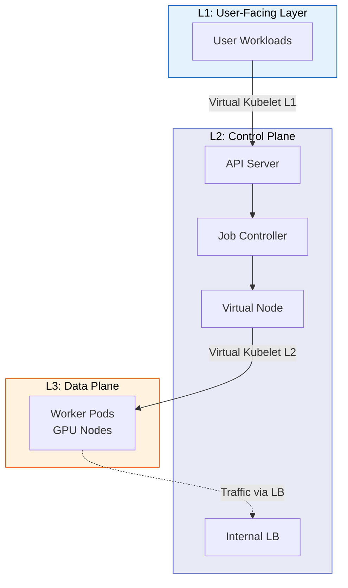
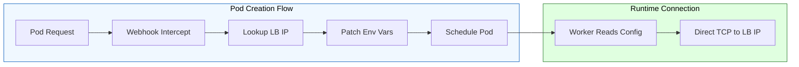
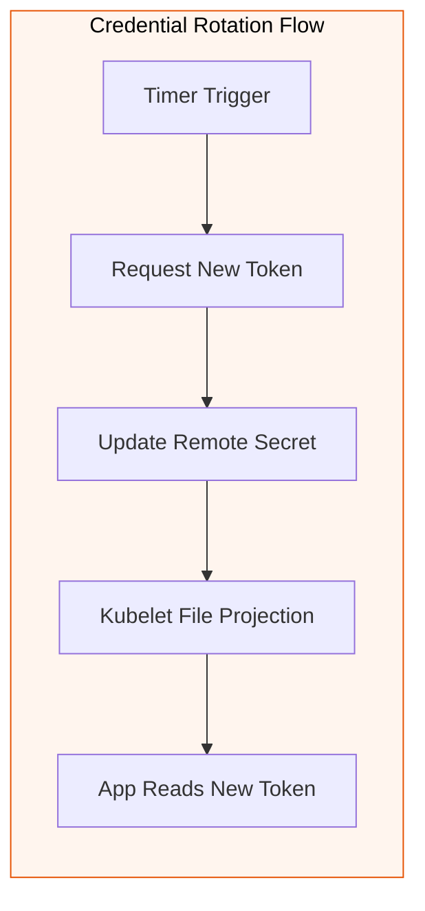

# Scaling Through Layers: Recursive Ray Resource Pooling Architecture Based on Virtual Kubelet

> **Note**: Due to confidentiality agreements, specific implementation details, internal service names, and proprietary protocols have been abstracted. The architectural patterns and engineering principles described here represent general industry practices.

---

## Abstract

This article details how to solve the classic challenges of "compute-storage separation" and "multi-tenant isolation" in large-scale AI SaaS platforms. We adopted a **"K8s on K8s"** recursive virtualization pattern, and through our self-developed **Identity & Network Mesh** middleware, successfully bridged the gap between Kubernetes logical networks and physical networks in cross-cluster scenarios, achieving **significant capacity scaling** and **substantial TCO reduction**.

---

## 1. Situation (Context & Challenges)

When building the next-generation AI training platform, we faced structural bottlenecks that a single Kubernetes cluster couldn't solve.

### 1.1 Business Context: The Dual Constraints of SaaS

Our platform needed to simultaneously serve the **Control Plane's** high stability requirements and the **Data Plane's** extreme elasticity requirements:

* **Control Plane**: Responsible for billing, state management, and CRD Operators. CPU-intensive, requiring **zero downtime**.
* **Data Plane**: Responsible for large-scale distributed compute. GPU-intensive, relying on **reserved/spot instances** for cost reduction, with massive scale fluctuations.

### 1.2 Technical Pain Points: Physical Connection, Logical Disconnection

We decided to adopt a **multi-cluster cascading architecture** to schedule compute workloads to remote GPU clusters. Although all clusters were in the same VPC (Layer 3 connectivity), we hit Kubernetes's "boundary wall":

1. **Network Split-Brain**: Remote Workers couldn't recognize the master cluster's **ClusterIP** (virtual IP) or use the master cluster's **CoreDNS** for service resolution.
2. **Identity Gap**: Remote Pods held local ServiceAccounts by default, unable to pass the master cluster API Server's **AuthN/AuthZ**, preventing the Autoscaler from calling back to the master for scaling.
3. **Shadow IT**: If remote clusters were allowed to scale independently, the master would lose control over Quota and Billing.

---

## 2. Task (Goals & Responsibilities)

As the core architect, my goal was to design and implement a **"physically separated, logically unified"** resource governance system.

### 2.1 Core Objectives

1. **Build K8s on K8s Recursive Architecture**: Use **Virtual Kubelet (VK)** to abstract heterogeneous GPU clusters as an "infinitely large virtual node" for the upper-layer Master.
2. **Enable Cross-Boundary Communication**: Achieve low-latency cross-cluster RPC communication without complex VPN or Overlay network tunneling.
3. **Unify Identity Plane**: Implement cross-cluster **Credential Projection** to ensure Control Flow always converges to the Master.

---

## 3. Action (Key Architecture & Technical Implementation)

To address these challenges, we designed a complete solution encompassing **recursive virtualization**, **network penetration**, and **identity mesh**.

### 3.1 Architecture Layer: Recursive Resource Abstraction (The Recursive Pattern)

Rather than treating the system as a simple frontend/backend, we defined two levels of virtualization to completely shield underlying resources.

* **L1 Virtualization (User -> SaaS)**: Users see the SaaS Master as a standard K8s cluster, unaware of backend complexity.
* **L2 Virtualization (SaaS Master -> GPU Pool)**: Master abstracts multiple Client GPU Clusters into a unified resource pool via VK.

### 3.2 Network Decision: Link Selection & Trade-offs

When connecting L2 Master and L3 Client communication links, we evaluated multiple solutions and ultimately chose **Internal Load Balancer (L4) + Webhook Injection**.

#### Why Choose Internal LB? (The Chosen Path)

* **Physical Reachability**: Internal LB provides a **VPC internal IP** (Underlay Network). This is natively routable for all compute nodes within the same VPC.
* **High Performance & Stability**: Distributed compute frameworks need to handle high-frequency heartbeats. L4 LB provides hardware-accelerated, high-throughput, low-latency forwarding with a fixed IP.
* **Security Boundary**: Only exposes specific ports, and traffic is completely restricted within the VPC.

#### Alternatives Considered

| Candidate Solution | Technical Principle | Why Rejected |
| --- | --- | --- |
| **Option A: Cross-cluster Overlay** | Establish encrypted tunnel (IPSec) | **Over-engineering**: We don't need full mesh connectivity, and Overlay encapsulation adds latency. |
| **Option B: CoreDNS Stub** | DNS forwarding | **Physical unreachability**: The resolved ClusterIP is still a virtual IP that Client nodes can't route to. |
| **Option C: NodePort** | Open high ports | **Security nightmare**: Exposes too much attack surface and requires maintaining complex Node IP lists. |

#### Technical Details: Network Injector Interception Logic

To let Workers connect to the Load Balancer without awareness, we used a Mutating Webhook for "dynamic surgery" during Pod creation.

*Detailed sequence flows are abstracted for confidentiality.*

### 3.3 Identity Layer: Identity Mesh & Credential Projection

To address the **Identity Gap**, we implemented a **declarative credential injection and auto-refresh** mechanism.

* **Credential Projection Controller**: Packages Master's Token as a Secret and syncs it to the Client Cluster.
* **Token Auto-Refresh (Rotation)**: Designed a state machine that refreshes Tokens periodically, utilizing Kubelet's file projection feature for **zero-downtime** rotation.

#### Technical Details: Cross-Cluster Identity Hot Rotation

*Detailed implementation specifics are abstracted for confidentiality.*

### 3.4 Governance Layer: Centralized Control

We adhered to the **"Control Flow Returns to Master"** design principle.

* **Billing Gatekeeper**: Forced the Autoscaler to call back to Master API to request resources, ensuring every scaling operation passes **Quota Check**, eliminating "Shadow IT".
* **Fault Domain Isolation**: Anchored stateful control components in the stable Master cluster. Even if underlying GPU nodes (Spot Instances) are massively reclaimed, the brain survives with self-healing capability.

---

## 4. Result (Outcomes & Impact)

This architecture was successfully deployed in production, supporting stable operation of large-scale heterogeneous compute clusters.

### 4.1 Quantitative Metrics

* **Capacity Scaling**: Achieved **significant capacity scaling**, breaking through single-cluster bottlenecks to regional-level resource pools.
* **Cost Optimization**: By seamlessly scheduling compute workloads to reserved/spot instance pools, achieved **substantial TCO reduction**.
* **Operational Efficiency**: Automated telemetry and fault isolation mechanisms significantly reduced **Mean Time to Detection (MTTD)** of problematic workers.

### 4.2 Qualitative Value

* **Ultimate Compute-Storage Separation**: Truly achieved physical and logical decoupling of Control Plane and Data Plane.
* **Seamless User Experience**: Users continue using standard K8s API, completely unaware of the underlying cross-cluster complex topology.
* **Standardized Security Compliance**: Through unified Token rotation and least-privilege principles, solved long-standing static credential leakage risks.

---

## 5. Summary

This case proves that in the cloud-native era, **"distributed execution"** doesn't mean sacrificing **"centralized governance"**. Through **K8s on K8s** recursive design and **Mesh** technology's fine-grained traffic/identity control, we provided a universal architectural paradigm for large-scale AI compute infrastructure.
