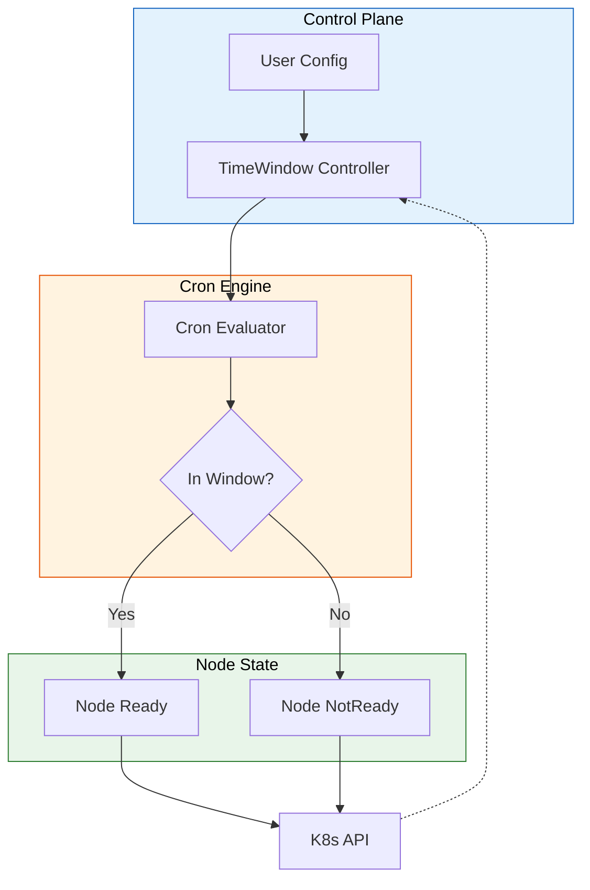
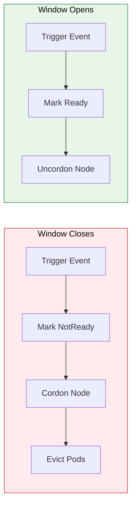
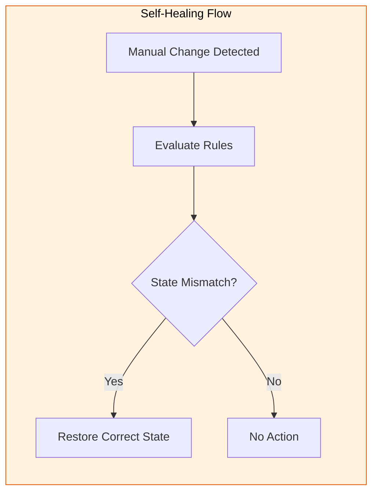

# Master of Time: Kubernetes Node Time-Sharing Architecture Based on Virtual Kubelet

> **Note**: Due to confidentiality agreements, specific implementation details, internal service names, and proprietary protocols have been abstracted. The architectural patterns and engineering principles described here represent general industry practices.

---

## Abstract

In High-Performance Computing (HPC) and AI training scenarios, balancing "high compute costs" with "non-full-time usage requirements" is a classic FinOps challenge. This article introduces a declarative time-window scheduling solution based on **Virtual Kubelet**. Through our self-developed **TimeWindow Controller**, we upgraded traditional operations scripts to a Kubernetes-native **Cron-driven state machine**, achieving dynamic "time-sharing" of GPU nodes, effectively solving state consistency issues under network partitions, and supporting complex multi-timezone scheduling strategies.

---

## 1. Situation (Context & Challenges)

With the large-scale deployment of high-end GPU nodes, we faced significant resource waste issues.

### 1.1 Business Pain Points: The Tidal Effect of Compute

* **High-Cost Idle Time**: Many R&D and training tasks only run during business hours (e.g., 9:00-18:00). Outside working hours, these expensive multi-GPU nodes sit idle, burning massive cloud computing budgets.
* **Rigid Reservations**: To ensure resources are available the next morning, teams often don't dare to release nodes, leading to severe mismatch between resource utilization and costs.

### 1.2 Technical Bottlenecks: Defects of Traditional Solutions

Early attempts using CronJob scripts or scheduled on/off solutions had serious **distributed system defects**:

1. **State Inconsistency**: If network partitions occur or scripts fail, nodes might get stuck in "should be off but isn't" or "should be on but isn't" intermediate states, with no auto-recovery mechanism.
2. **Lack of Declarative Semantics**: Unable to express "resource only available during specific time windows" through standard K8s API, preventing the scheduler from perceiving future resource changes.
3. **Incomplete Cleanup (Zombie Pods)**: When time windows close, residual Pods often can't terminate gracefully, leading to interrupted data writes or continued billing.

---

## 2. Task (Goals & Responsibilities)

As the infrastructure architect, my goal was to build an **automated, declarative, and robust** time-window scheduling system.

### 2.1 Core Design Goals

1. **K8s Native**: Abandon external scripts, use CRD or Annotations for standardized Kubernetes resource management.
2. **Self-Healing**: System must have a Reconciliation Loop to ensure node actual state always matches time rules.
3. **Precise Control**: Support Cron expression-level fine control (minute precision), with native multi-timezone support.

---

## 3. Action (Key Architecture & Technical Implementation)

We designed a solution centered on **TimeWindow Controller**, leveraging **Virtual Kubelet (VK)** flexibility to manipulate node state.

### 3.1 System Architecture: Cron-Driven State Machine

We embedded a lightweight controller in the Virtual Kubelet Provider that calculates expected node state in real-time based on Cron expressions.

### 3.2 Key Decision: Why Manipulate Node Ready Instead of Taint?

During technical selection, we evaluated two approaches: using `Taint/Toleration` to repel Pods, or directly manipulating `Node Condition`. We chose the latter.

* **Comparison**:
  * **Taint**: While it blocks scheduling, K8s scheduler still considers the node "healthy". This causes Cluster Autoscaler to misjudge total resources, and requires additional logic to evict existing Pods.
  * **Node Ready/NotReady (Status)**: This is K8s's most fundamental availability signal.
    * **Native Affinity**: When a node is NotReady, Service LoadBalancer automatically removes the backend, and Deployments auto-trigger rescheduling.
    * **Semantic Accuracy**: Clearly tells users "this node is currently unavailable", matching `kubectl get nodes` intuitive experience.

### 3.3 Implementation Details: Lifecycle Management & Self-Healing

We defined strict state transition flows to ensure zero business impact and automatic anomaly recovery.

#### Time Window Transition Flow

*Detailed lifecycle sequences are abstracted for confidentiality.*

#### Self-Healing Logic

The controller watches for manual interference and automatically restores state consistency based on current time rules.

*Detailed implementation specifics are abstracted for confidentiality.*

### 3.4 Advanced Features: Multi-Timezone & Dynamic Reload

* **Multi-Timezone Support**: Maintain independent Cron instances for each timezone. Critical for cross-national teams sharing the same cluster architecture.
* **Hot Reload**: Controller watches ConfigMap changes. When time window rules are modified, no process restart needed - controller automatically updates for zero-downtime configuration changes.

---

## 4. Result (Outcomes & Impact)

This solution has been deployed at scale in production, managing thousands of virtual nodes with significant operational and cost benefits.

### 4.1 Quantitative Metrics

* **Cost Savings**: For "9-to-6" R&D clusters, resource runtime reduced significantly, achieving **substantial compute cost reduction**.
* **Operational Efficiency**: Eliminated manual on/off operational burden, node state anomaly tickets dropped to zero (thanks to controller's self-healing mechanism).

### 4.2 Architectural Value

* **FinOps Implementation**: Provided a technical means to enforce budget control policies, strictly aligning resource usage with business value production time.
* **Standardized Abstraction**: Through Virtual Kubelet, shielded differences in underlying resources (could be VMs, bare metal, or serverless instances), providing unified "temporal elasticity" semantics to upper layers.

---

## 5. Summary

This case demonstrates how to use **Kubernetes Controller patterns** to solve state consistency issues that traditional operations scripts couldn't handle. By defining time windows as code (Configuration as Code) and leveraging Virtual Kubelet's flexibility, we successfully built a cloud-native scheduling system with **"time-sharing"** capability, providing a standard paradigm for enterprise AI infrastructure cost optimization.
