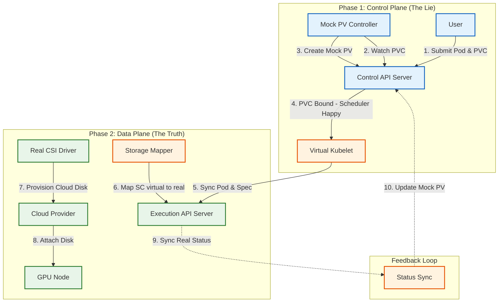
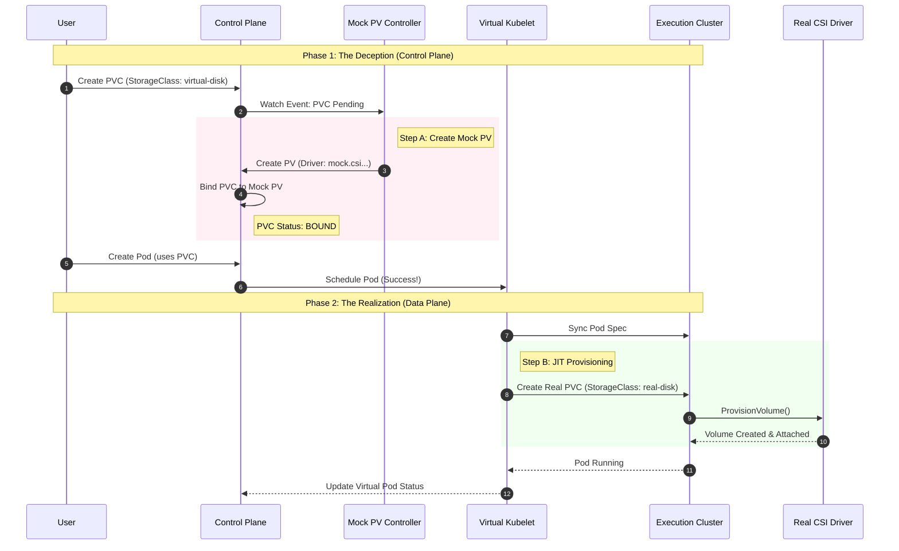
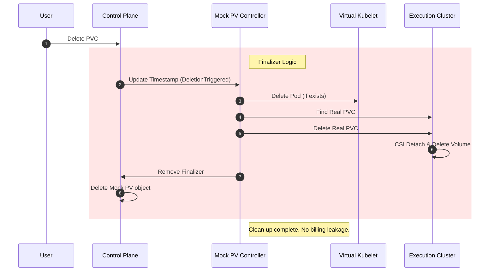

# The Art of Deception: Cross-Cluster Kubernetes Storage Virtualization Based on Mock PV

## Abstract

In cross-cluster architectures, the physical separation of compute and storage prevents Kubernetes's native scheduler from completing PersistentVolumeClaim (PVC) binding, thus refusing to schedule. This article presents a **"Mock PV"** based two-phase provisioning mechanism that virtualizes storage resources in the Control Plane to pass scheduling checks, then lazy-binds real cloud disks in the Data Plane, achieving **100% native API compatibility** for cross-cluster storage scheduling while ensuring on-demand resource creation and automatic cleanup.

---

## 1. Situation (Context & Challenges)

As business evolved toward **Multi-Cluster** and **Hybrid Cloud** architectures, we encountered a thorny "chicken or egg" deadlock.

### 1.1 Business Scenario

Users submit jobs to a unified **Control Cluster**, expecting to use high-performance cloud disks (like ESSD). However, actual Pods are delivered to remote **Execution Clusters** via **Virtual Kubelet (VK)**.

### 1.2 Technical Conflict: Kubernetes Scheduler's Hard Constraint

Kubernetes's native scheduler has an inviolable rule:

> **Pod is unschedulable until all PVCs are bound.**

This is a reasonable protection mechanism within a single cluster, but becomes an obstacle in cross-cluster scenarios:

1. **Physical Non-existence**: The control cluster has no real cloud disk CSI driver, unable to create real PVs.
2. **Logical Deadlock**: Without creating a PV, PVC can't be Bound; without PVC Bound, Pod can't be scheduled to VK; without Pod reaching VK, we don't know which remote cluster should create the real disk.

### 1.3 Cost of Traditional Solutions

* **Pre-provisioning**: Manually creating PV/PVC in both clusters. This greatly increases operational burden and doesn't support dynamic scaling.
* **Resource Waste**: To get PVC Bound, real disks must be created in advance. If Pod scheduling ultimately fails or queues, these disks sit idle accruing charges.

---

## 2. Task (Goals & Responsibilities)

As the storage architect, my goal was to design a storage orchestration system that **"deceives the scheduler while being honest to users"**.

### 2.1 Core Design Principles

1. **API Transparency**: Users don't need to modify any YAML, continuing to use standard `PersistentVolumeClaim`.
2. **Two-Phase Provisioning**:
   * **Phase 1 (Control Plane)**: Quickly return a "virtual promise" to let the scheduler proceed.
   * **Phase 2 (Data Plane)**: After Pod lands, precisely deliver real storage resources.
3. **No State Leakage**: Ensure when PVC is deleted, remote real disks are also cascade-destroyed.

---

## 3. Action (Key Architecture & Technical Implementation)

We designed a storage virtualization solution based on **Mock PV + CSI Proxy**.

### 3.1 Architecture Overview: Two-Phase Provisioning Pipeline



### 3.2 Core Technique: The Art of Mock PV Construction

To make the Kubernetes scheduler "believe" storage is ready, we construct a special `PersistentVolume` object.

```yaml
apiVersion: v1
kind: PersistentVolume
metadata:
  name: pvc-mock-uuid-1234
  annotations:
    # Critical marker: prevents real CSI driver from operating on it
    virtual-kubelet.io/mock-pv: "true"
spec:
  accessModes: [ReadWriteOnce]
  capacity: { storage: 100Gi }
  # Points to a non-existent driver, avoiding triggering any real mount logic
  csi: { driver: "mock.csi.virtual-kubelet.io", volumeHandle: "mock-vol-123" }
  # Set to Delete for cascade deletion
  persistentVolumeReclaimPolicy: Delete
  volumeMode: Filesystem
```

**Design Insight**:

* **Driver Mocking**: We declare a fake CSI Driver name. Kubernetes control plane only checks PV object existence, not whether the Driver is actually running. This is the core trick for "deceiving" the scheduler.

### 3.3 StorageClass Dynamic Mapping

We implemented a **StorageClass Mapper** responsible for protocol translation during cross-cluster transfer.

* **Naming Convention**:
  * User Cluster: `virtual-disk-essd-pl1` (virtual class)
  * Execution Cluster: `alicloud-disk-essd` (real class, PerformanceLevel=PL1)
* **Auto-Translation**: VK Provider automatically identifies `virtual-*` prefix when syncing Pod Spec, parsing suffix to determine real cluster's StorageClass parameters, achieving **"Write Once, Run Anywhere"**.

### 3.4 State Consistency & Garbage Collection

This is a distributed system, so state synchronization is crucial.

#### Provisioning & Binding Sequence

This sequence diagram shows how the system deceives the scheduler and completes real resource delivery remotely.



#### Cascading Deletion Sequence

This diagram shows how we handle resource cleanup to prevent "orphan volumes" from causing billing leakage.



---

## 4. Result (Outcomes & Impact)

This system completely solved the cross-cluster storage scheduling challenge, bringing significant technical and business value to the platform.

### 4.1 Technical Value

* **100% Native Compatibility**: Users are completely unaware of underlying cross-cluster logic. `kubectl apply -f pod-with-pvc.yaml` just works.
* **Precise Scheduling**: Cloud disks only start creating at the moment Pod is actually scheduled to the execution cluster. Avoids resource waste and lock-in from "pre-creation".

### 4.2 Business Value

* **Pay-as-you-go**: Eliminated idle storage costs. Cloud disk lifecycle strictly follows Pod - destroyed when Pod ends (or retained, depending on Policy).
* **Multi-Cloud Adaptation**: This architecture is cloud-neutral. We can map to `gp3` on AWS, `essd` on Alibaba Cloud, achieving true hybrid cloud storage orchestration.

---

## 5. Summary

This case demonstrates how to bypass Kubernetes's rigid scheduling constraints through **"Virtualization & Mocking"**. We not only solved the technical problem but also achieved **Just-in-Time (JIT) provisioning** of storage resources through fine-grained lifecycle management, providing an elegant solution for storage governance in multi-cluster architectures.
