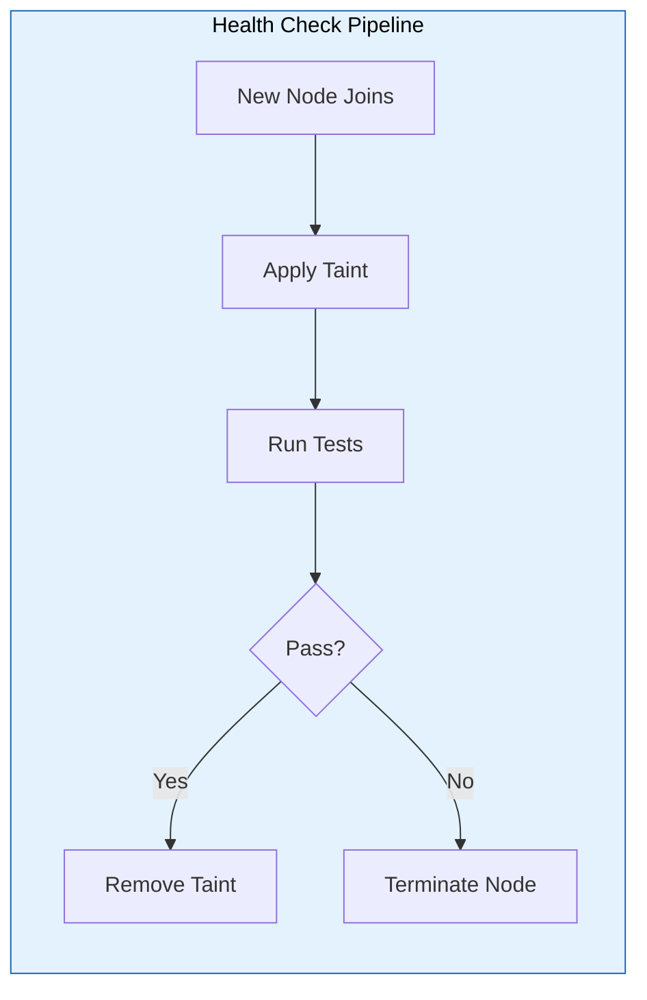
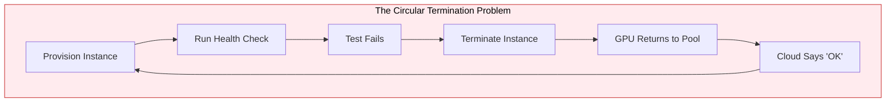
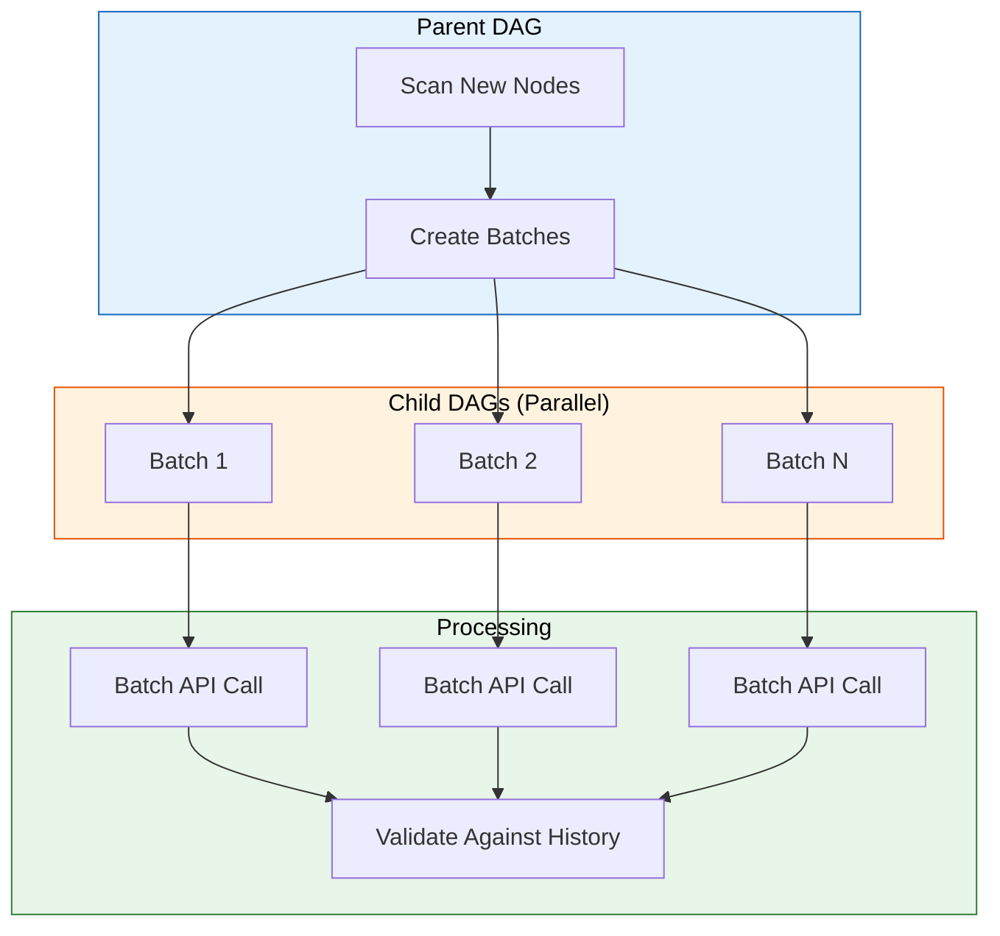
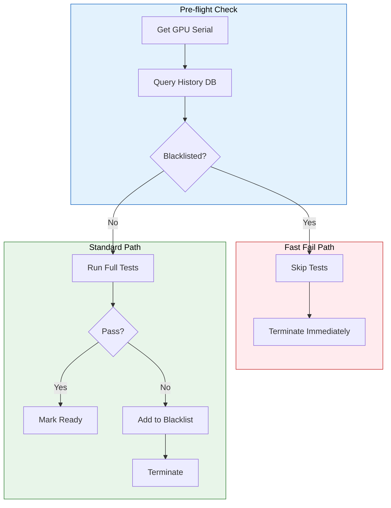

# Stopping Silicon Decay: Building a Stateful Health Check System for Large-Scale GPU Clusters

> **Note**: Due to confidentiality agreements, specific implementation details, internal service names, and proprietary protocols have been abstracted. The architectural patterns and engineering principles described here represent general industry practices.

---

## Abstract

In hyperscale AI infrastructure, hardware failures are the norm, not the exception. This article explores the **"Circular Termination"** problem we encountered while managing GPU clusters with thousands of nodes—where the cloud provider reclaims GPUs we flagged as faulty, only to reallocate them back to us. To solve this costly issue, we rebuilt the health check system from scratch, evolving from a **stateless linear scan** to a **stateful architecture based on GPU serial number tracking**. By introducing a Parent-Child DAG parallel scheduling model and batch API optimization, we eliminated wasteful compute spending while significantly reducing detection latency during large-scale scaling.

---

## 1. Situation: The Stateless Legacy

In the early stages, our health check was a simple linear workflow. The system assumed "Instance ID is unique," so every time a new node joined, we treated it as entirely new hardware.

### 1.1 Technical Implementation

We used Kubernetes Taints (`health-check-NotStarted:NoSchedule`) to isolate new nodes and ran a multi-phase pipeline including CPU/Mem checks, hardware validation, GPU diagnostics, and communication tests.

### 1.2 The Linear Detection Flow (Happy Path)

This workflow worked well for small clusters—simple and intuitive logic:

*Detailed test sequences are abstracted for confidentiality.*

---

## 2. The Problem: Ghost Hardware & Circular Termination

As cluster scale grew, we discovered a bizarre phenomenon: some nodes would be terminated, new nodes would immediately fill in, but then fail again with the same hardware errors.

### 2.1 Root Cause Analysis

This is a classic **distributed systems state inconsistency** problem.

* **Tenant View (Us)**: This GPU is broken, discard it.
* **Provider View (Cloud)**: This GPU passed basic POST checks, it's fine—reclaim it to the resource pool.
* **Result**: The cloud provider mounts the same physical GPU (same Serial Number) to a new Instance ID and reallocates it to us.

Because the original DAG was **stateless**, it only recognized Instance IDs, not underlying hardware IDs. This caused us to pay significant costs in boot-up and idle fees testing the same broken card repeatedly.

### 2.2 The Cost Loop

*The same physical GPU keeps cycling back, wasting compute budget.*

---

## 3. Action: Stateful & Parallel Architecture Evolution

To solve this problem, we needed to introduce **"hardware fingerprint tracking"**. But this introduced a new performance bottleneck: retrieving GPU serial numbers has significant latency per node. When scaling hundreds of nodes at once, serial calls would cause massive delays.

### 3.1 Architecture Decision: Parent-Child DAG + Batch Processing

We adopted a **Map-Reduce** design philosophy, breaking the monolithic DAG into a Parent-Child pattern:

1. **Parent DAG (The Dispatcher)**: Handles global scanning and sharding, splitting nodes into multiple batches.
2. **Child DAG (The Worker)**: Processes individual batches, using batch API calls for vectorized operations.

### 3.2 Parallel Batch Retrieval

This design reduced API call count from **O(N)** to **O(N/BatchSize)**, dramatically reducing I/O wait time.

*Detailed batch processing sequences are abstracted for confidentiality.*

---

## 4. Technical Deep Dive: Fast Fail Strategy

The core value of the new architecture lies in **"Pre-flight Check"**. Before launching expensive diagnostic test containers, we first check if this GPU is on our "blacklist".

### 4.1 State Management Logic

We maintain a database table recording all GPU Serial Numbers and their health status.

* **Cache Hit (Bad History)**: Immediately mark node Failed, terminate instance.
* **Cache Miss (New/Good)**: Proceed with normal testing.
* **Write Back**: If a new node fails testing, write its Serial Number to the blacklist.

### 4.2 Defensive Termination Logic

*Detailed termination sequences are abstracted for confidentiality.*

---

## 5. Result (Outcomes & Impact)

This architecture overhaul was not just a technical upgrade—it was a successful **FinOps** practice.

1. **Eliminated the Money Pit**: Through GPU serial number tracking, we completely blocked faulty hardware from cycling back online. For large clusters, we intercept multiple invalid allocations daily, saving significant monthly compute costs.

2. **Order of Magnitude Faster Scaling**: Through Parent-Child DAG parallelization and batch API calls, we dramatically reduced pre-check latency for large scale-ups, ensuring just-in-time compute resource delivery.

3. **Data as an Asset**: The GPU health database we built became powerful evidence for communicating with cloud providers about claims and hardware replacements.

---

## 6. Summary

In cloud-native architecture, we cannot assume resources provided by cloud vendors are always reliable. By introducing **stateful hardware fingerprint tracking** and **parallel batch processing architecture**, we not only solved the technical performance bottleneck but also built a solid cost firewall for the company on the business side.
