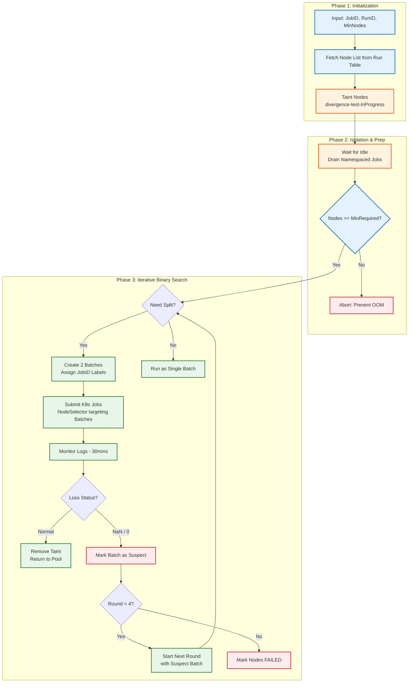
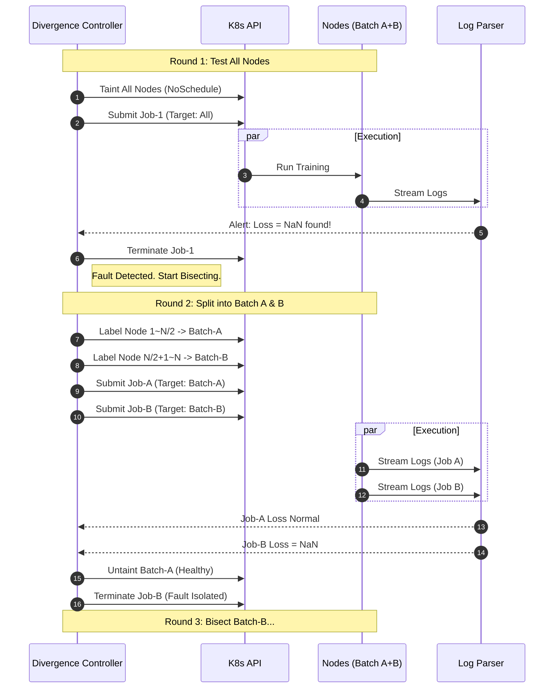

# Automating the Needle in a Haystack: Binary Search-Based AI Training Divergence Fault Isolation System

## Abstract

In large-scale distributed training, Loss divergence (becoming NaN or 0) is an extremely difficult phenomenon to troubleshoot, often hard to distinguish between **infrastructure failures** (such as GPU soft errors, communication packet loss) or **user code issues** (such as gradient explosion). This article introduces the **Divergence Test DAG**, an automated diagnostic tool specifically designed for Training/Fine-tuning scenarios. By implementing an **Iterative Binary Search** algorithm on Kubernetes clusters, we successfully reduced fault node isolation time from hours to minutes, achieving clear responsibility boundary delineation between infrastructure and user models.

---

## 1. Situation (Context & Challenges)

In the early stages of AI platform development, we faced insufficient coverage from **Node Problem Detector (NPD)**.

### 1.1 Business Pain Points: The Gray Zone of Responsibility

When users report training task failures with Loss curves showing `NaN` or `0`, the SRE team often faces a dilemma:

* **User Perspective**: "My code runs fine elsewhere, it must be your broken nodes."
* **Operations Perspective**: "Monitoring shows normal CPU/GPU utilization, it's probably your hyperparameters exploding."

### 1.2 Technical Challenges: Unreproducible Ghost Failures

* **Randomness**: Single-machine tests often cannot reproduce the issue—problems only appear during multi-machine distributed training (DDP).
* **High Isolation Cost**: In a training job with 64 GPUs, finding one bad card is like finding a needle in a haystack. Manual A/B testing is time-consuming and error-prone.

---

## 2. Task (Goals & Responsibilities)

As the platform architect, my goal was to develop an **automated fault isolation system** to quickly arbitrate "code vs infrastructure" issues.

### 2.1 Core Design Goals

1. **Automated Binary Search**: Replace manual grouping tests with automatic **Divide-and-Conquer** strategy.
2. **Production Environment Isolation**: During testing, use **Taint** mechanism to ensure nodes aren't preempted by other production tasks.
3. **Resource Boundary Protection**: Must consider minimum node requirements (Minimum Required Nodes) to prevent OOM-induced false positives from too few nodes.

---

## 3. Action (Key Architecture & Technical Implementation)

We designed a diagnostic workflow centered on the **Divergence Test DAG**, using Kubernetes Jobs to dynamically orchestrate test tasks.

### 3.1 Core Algorithm: Distributed Binary Search

We applied traditional algorithmic thinking to operations scheduling. The system executes a maximum of **4 Rounds** of tests, each round splitting the suspected faulty node pool into two Batches, halving the Batch Size.

#### State Machine Logic

* **Loss == NaN/0** → **Divergent (Faulty)**: This Batch contains bad nodes, proceed to next round of bisection.
* **Loss is Normal** → **Healthy**: This Batch's nodes are healthy, remove Taint and return to resource pool.

### 3.2 System Architecture Workflow

### 3.3 Key Technical Details

#### 1. Resource Protection & OOM Avoidance

During bisection, Batch Size continuously decreases. If the training task has rigid VRAM requirements, too few nodes will cause OOM.

* **Strategy**: Introduce `Minimum Required Nodes` parameter.
* **Logic**: If `CurrentBatchSize < MinNodes`, stop bisecting and run full test on that Batch. This prevents misdiagnosing OOM as hardware failure.

#### 2. Dynamic Label Injection

To precisely schedule Kubernetes Jobs to our split Batches, we don't rely on static grouping but dynamically label:

* **Controller**: Label Batch A nodes with `divergence-job-id: <uuid-a>`.
* **Job Spec**: Generate Pods with `nodeSelector: {divergence-job-id: <uuid-a>}`.

#### 3. Real-time Log Stream Analysis

The system doesn't wait for task completion (which could take hours), but real-time `tails` training logs.

* Once `loss: nan` or `loss: 0.0000` is captured, immediately terminate the Job and mark that Batch as failed. This achieves **Fail Fast**.

### 3.4 Sequence Diagram: Binary Isolation Interaction

---

## 4. Result (Outcomes & Impact)

The Divergence Test DAG completed a missing piece of our observability puzzle.

1. **Reduced MTTR (Mean Time To Resolution)**: Reduced fault node isolation time from **manual hours** to **automated 30-60 minutes**.
2. **Clear Responsibility Boundaries**:
   * If all group tests reproduce NaN, it proves **user code/data issue** (Algorithm Issue).
   * If only specific groups reproduce, it proves **hardware failure** (Infrastructure Issue).
3. **Improved Resource Utilization**: Healthy nodes are immediately released back to the resource pool after each test round, minimizing compute idle time during troubleshooting.

---

## 5. Summary

By applying computer science's most fundamental **Binary Search algorithm** to Kubernetes node troubleshooting, we built a powerful fault isolation microscope. This not only solved the specific "Loss divergence" problem but also provided a universal architectural paradigm for handling "ghost failures" in large-scale distributed systems.
